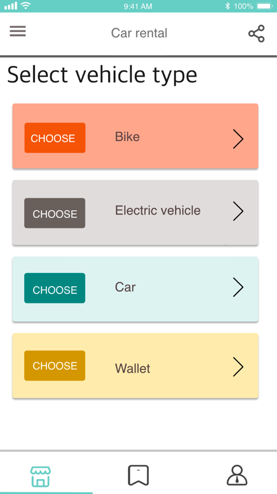

# E-Vehicle Rental System

Welcome to the **E-Vehicle Rental System**, an innovative platform designed to revolutionize vehicle rentals. With an easy-to-use interface, users can explore nearby vehicles available for rent through an Android-based map interface. Renting is simplified with options to scan QR codes or enter serial numbers.

## 🛠️ Technology Stack

- **User Interface**: Android application with integrated map view for vehicle exploration.
- **Backend Management**: A web interface allowing administrators to manage vehicle types, locations, and other essential details.
- **Data Visualization**: Admins benefit from a visual dashboard, showcasing diverse vehicle rental data for efficient management.

## 📖 Documentation

Comprehensive documentation has been provided to understand the system's architecture, requirements, and progress tracking:

- [API References](./API%20References.docx)
- [Gantt Chart](./Gantt%20Chart.xlsx)
- [Project Report](./Report.docx)
- [Requirement Analysis](./Requirement%20Analysis.xlsx)

## 🎥 Demonstrations

- **Demo Video**: A complete walkthrough of the system can be found at [demo_video.MP4](./demo/demo_video.MP4) in the `demo` folder.
- **Reference Images**:
  - 
  - 
  - 
  - 
  - 
  - 
  - 
  - 
  - 
  - 
  - 
  - 
  - 
  - 
  - 
  - 
  - 
  - 
  - 
  - 
  - 

## 💼 Contributions

In this project, I was responsible for several design elements and spearheaded most of the backend development. Other contributors and their roles can be identified at the beginning of the [demo video](./demo/demo_video.MP4).

Thank you for exploring the **E-Vehicle Rental System**. We believe it's the future of vehicle rentals!

## history commits

see [history commits](https://github.com/shadowxiehao/Car_Rental_System_SpringMVC)
